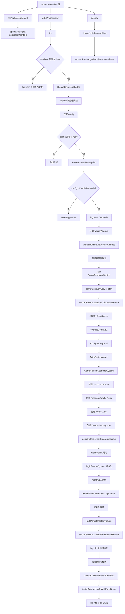
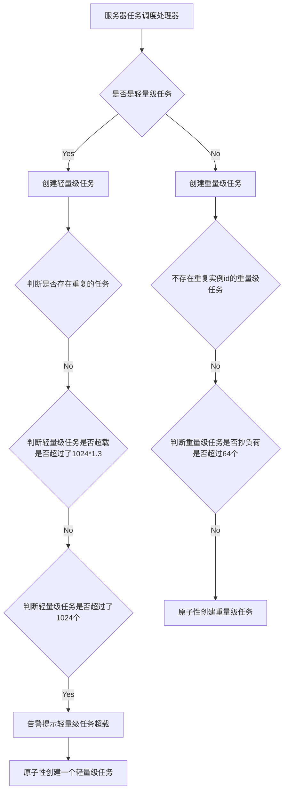
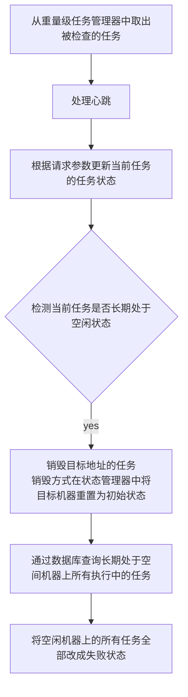
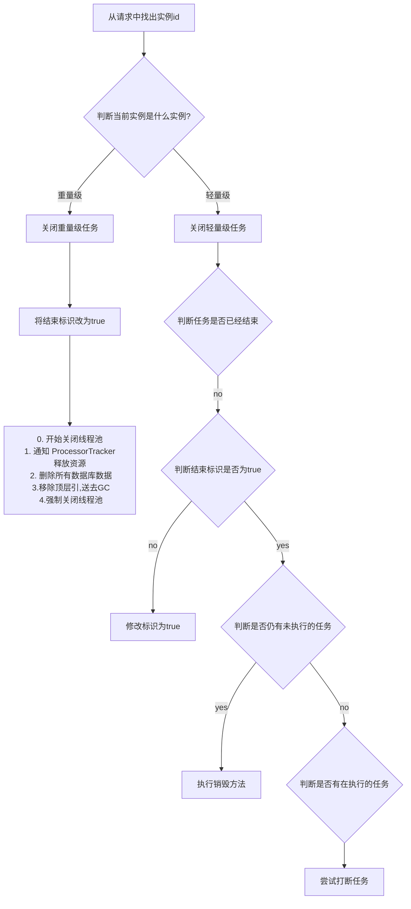
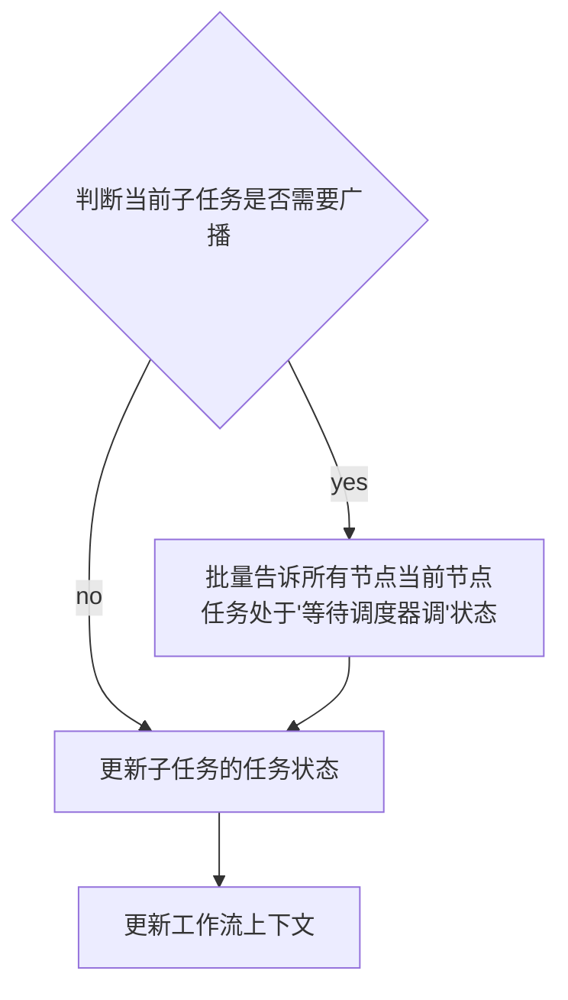
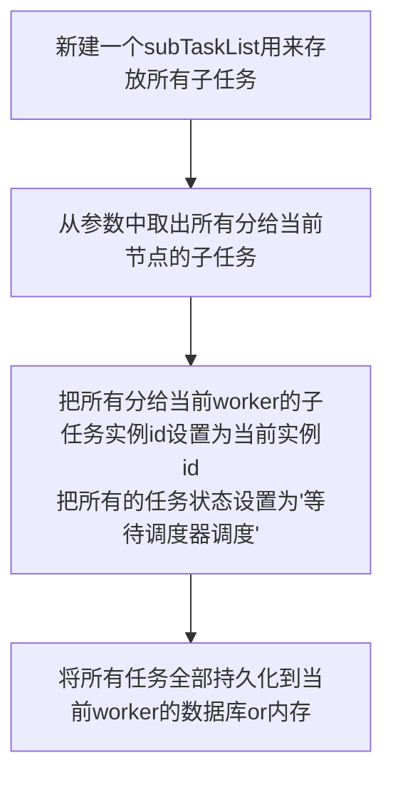

# 快速入门

## 基本概念


### 分组概念：

- appName：应用名称，建议和用户实际接入PowerJob 的应用名称保持一致，用于业务分组与隔离，一个appName等于一个业务集群，也就是实际的一个Java项目。

### 核心概念：

- 任务（Job）：描述了需要被PowerJob调度的任务信息，包括任务名称、调度时间、处理信息等。
- 任务实例（JobInstance，简称Instance）：任务被调度执行后会生成任务实例，任务实例记录了任务的运行时信息（任务与任务实例的关系类似于类与对象的关系）。
- 作业（Task）：任务实例的执行单元，一个JobInstance存在至少一个Task，具体规则如下：
  - 单机任务（STANDALONE）：一个JobInstance对应一个Task
  - 广播任务（BROADCAST）：一个JobInstance对应N个Task，N为集群机器数量，即每一台机器都会生成一个Task。
  - Map/MapReduce任务：一个JobInstance对应若干个Task，由开发者手动map产生。
- 工作流（Workflow）：由DAG（有向无环图）描述的一组任务（Job），用于任务编排。
- 工作流实例（WorkflowInstance）：工作流被调度执行后会生成工作流实例，记录了工作流的运行时信息。

### 扩展概念

- JVM容器：以Maven工作项目的维度组织一堆Java文件（开发者开发的众多Java处理器），可以通过前端网页动态发布并被执行器加载，具有极强的扩展能力和灵活性。
- OpenAPI：允许开发者通过接口来完成手工的操作，让系统整体变得更加灵活。开发者可以基于API便捷地扩展PowerJob原有的功能。
- 轻量级任务：单机执行且不需要以固定频率或者固定延迟执行的任务（>=v4.2.1)
- 重量级任务：非单机执行或者以固定频率/延迟执行的任务（>=v4.2.1)

### 定时任务类型

- API：该任务只会由powerjob-client中提供的OpenAPI接口触发，server不会主动调度。
- CRON：该任务的调度时间由CRON表达式指定。
- 固定频率：秒级任务，每隔多少毫秒运行一次，功能与java.util.concurrent.ScheduledExecutorService#scheduleAtFixedRate相同。
- 固定延迟：秒级任务，延迟多少毫秒运行一次，功能与java.util.concurrent.ScheduledExecutorService#scheduleWithFixedDelay相同。
- 工作流：该任务只会由其所属的工作流调度执行，server不会主动调度该任务。如果该任务不属于任何一个工作流，该任务就不会被调度。

>  备注：固定延迟任务和固定频率任务统称秒级任务，这两种任务无法被停止，只有任务被关闭或删除时才能真正停止任务。


### 项目结构说明：

``` 
├── LICENSE
├── powerjob-client // powerjob-client，普通Jar包，提供 OpenAPI
├── powerjob-common // 各组件的公共依赖，开发者无需感知
├── powerjob-remote // 内部通讯层框架，开发者无需感知
├── powerjob-server // powerjob-server，基于SpringBoot实现的调度服务器
├── powerjob-worker // powerjob-worker, 普通Jar包，接入powerjob-server的应用需要依赖该Jar包
├── powerjob-worker-agent // powerjob-agent，可执行Jar文件，可直接接入powerjob-server的代理应用
├── powerjob-worker-samples // 教程项目，包含了各种Java处理器的编写样例
├── powerjob-worker-spring-boot-starter // powerjob-worker 的 spring-boot-starter ，spring boot 应用可以通用引入该依赖一键接入 powerjob-server
├── powerjob-official-processors // 官方处理器，包含一系列常用的 Processor，依赖该 jar 包即可使用
├── others
└── pom.xml

```


# 正式

## 调度中心（Powerjob-server）

> 一个公司统一部署Powerjob-server集群，各业务线应用直接接入使用。


## 处理器（Processor）

- Java处理器可根据代码所处位置划分为内置Java处理器和外置Java处理器，前者直接集成在宿主应用（也就是接入本系统的业务应用）中，一般用来处理业务需求；后者可以在一个独立的轻量级的Java工程中开发，通过JVM容器技术被worker集群热加载，提供Java的“脚本能力”，一般用于处理灵活多变的需求。
- Java处理器可根据功能划分为单机处理器、广播处理器、Map处理器和MapReduce处理器。
  - 单机处理器（BasicProcessor）对应了单机任务，即某个任务的某次运行只会有某一台机器的某一个线程参与运算。
  - 广播处理器（BroadcastProcessor）对应了广播任务，即某个任务的某次运行会调用集群内所有机器参与运算。
  - Map处理器（MapProcessor）对应了Map任务，即某个任务在运行过程中，允许产生子任务并分发到其他机器进行运算。
  - MapReduce处理器（MapReduceProcessor）对应了MapReduce任务，在Map任务的基础上，增加了所有任务结束后的汇总统计。


# 《读Powerjob源码有感》


# worker的启动流程（第一阶段）2024-07-22


## 1. 新建ohmyworker对象

读取配置文件中的属性。

根据配置文件中的属性，新建一个ohmyworker的对象。


## 2.通过配置信息，尝试连接server并设置值

1. 通过配置文件中的server，ip和端口，生成一个真实的服务地址。

2. 利用OKHttpClient给服务器发送get请求，请求调用的server接口为（/server/assert?appName=%s），appName指当前worker配置的appName


server端应当返回


success：成功标识

data：一个Long类型的appid（此appId是否是之前传的appName？）

> 看到后面操作后，感觉此appId为服务端返回的负责处理此worker的appId

将以上得到的所有信息放入workerRuntime对象中。

> 这里大胆猜测，workerRuntime是worker端用来存放所有运行时配置的类。此类的生命周期等同于worker应用。如果想要在运行中修改worker的某些配置，可以直接修改此类。（是否就可实现不需要重启服务，修改服务配置？）


3. 获取本机的连接信息，也放入WR中。
4. 创建一个定时线程池（核心线程数3）

初始化连接server相关的配置。

通过AppId和WR中的配置创建ServerDiscoveryService对象。

利用ServerDiscoveryService对象连接sever。


## 3.discovery方法

> 用来测试worker和server的连接，并选择出当前worker归哪个server的方法

1. 连接前，先将所有的配置文件中的服务器，设置到ip2Address中。

2. ServerDiscoveryService对象中有currentServerAddress属性

此属性表示worker当前指定的server

如果有指定的server，就返回当前server

否则通过调用“/server/acquire?appId=%d&currentServer=%s&protocol=AKKA”接口

确认当前机器或server服务器是否失活

检测失活过程中服务器会重试3次。（如果判断服务器失活，worker会自动关闭当前机器上所有的秒级任务，原因：认为server已将秒级任务分配给了其他worker应用）。


之后，通过之前创建的定时线程池每十秒不断递归discovery方法。


## 4.初始化 ActorSystem

> akka用来传递消息，server与worker

通过读取提前准备号的akka配置文件，创建一个ActorSystem，将此ActorSystem交给WR。

> 初始化ActorSystem过程中，会将多个参数交给WR。同时给ActorSystem设置了多个指标？？（看不懂）

只知道如果ActorSystem可以用来交互，同时上面设置的某些指标可以用来主动给server告警。


初始化日志系统，创建一个OmsLogHandler交给WR


## 5. 初始化存储

1. 从WR中取出之前的配置文件中的存储方式（磁盘or内存），来初始化一个taskPersistenceService对象

2. 初始化一个数据库连接，（两种方式磁盘or内存）。初始化连接后，会尝试删除上一次H2_PATH配置的文件。
3. 创建一个taskDAO对象，通过taskDAO对象初始化任务表（task_info表）每次重启时，此表都会删除并重新创建
4. 初始化结束，把taskPersistenceService对象交给WR


## 6.初始化定时任务

- 初始化Worker健康度定时上报Runnable，每15秒执行一次

通过CPU核心数，JVM内存空间，硬盘空间使用率，和用户自定义的指标来给当前机器打分

不断地把当前机器的分数提交给sever


- 向定时线程池中添加日志上传任务，每5秒上传一次

不断地将logQueue中的日志取出，交给ActorSystem中给server

logQueue的消费过程中全程上锁。

logqueue.poll()


## 流程图




## 小结


- ohMyWorker

worker的启动类，此类初始化时，会将各种配置信息（config）

> 主要会初始化下面几个对象


- WorkerRuntime

> 类似于spring的ApplicationContext，用来存放所有运行时的配置和信息


- oms，ActorSystem

创建一个ActorSystem，通过oms-worker.akka实现server和worker利用消息来通讯。ActorSystem会创建以下几种消息处理actor

1. 任务跟踪器
2. 处理器跟踪器
3. worker程序调度器
4. 异常处理器


- 定时线程池

用来存放worker的一些预设定时任务

1. 探活任务ServerDiscoveryService.discovery();（用来做服务注册和发现）
2. Worker健康度定时上报（通过CPU核心数，JVM内存空间，硬盘空间使用率，和用户自定义的指标来给当前机器打分）
3. 异步上传日志（不断地将logQueue中的日志取出，交给ActorSystem中给server）


# ActorSystem（2024-08-01）


## PowerjobRemoteEngine

用来控制整个Powerjob的网络层

在work启动时创建的一个空对象，后续操作时会用到里面的方法

## EngineConfig

```java
/**
 * 服务类型
 */
private ServerType serverType;
/**
 * 需要启动的引擎类型
 */
private String type;
/**
 * 绑定的本地地址
 */
private Address bindAddress;
/**
 * actor实例，交由使用侧自己实例化以便自行注入各种 bean
 */
private List<Object> actorList;
```

重点是其中的actorList对象，其中包含三个Actor对象：TaskTrackerActor、ProcessorTrackerActor、WorkerActor。


## ActorInfo对象

所有的actor对象拆解后的对象。其中包含所有actor对象，和它下面所有的Handler方法

```java
//   actor对象本身
    private Object actor;
//    当前这个actor对象类上的@Actor注解信息（主要包含path信息）
    private Actor anno;
//当前actor类中所有的HandlerInfo对象
    private List<HandlerInfo> handlerInfos;
```


## HandlerInfo对象

ActorInfo中的属性，包含不同ActorInfo下的Handler修饰的注解，和Handler注解的属性

```java
private HandlerLocation location;
/**
 * handler 对应的方法
 */
private Method method;

/**
 * Handler 注解携带的信息
 */
private Handler anno;
```


## LightTaskTrackerManager

> 轻量级任务管理器

```java
//    用来存放所有轻量级任务，key为实例ID，value是任务对象
private static final Map<Long, LightTaskTracker> INSTANCE_ID_2_TASK_TRACKER = Maps.newConcurrentMap();
```


## HeavyTaskTrackerManager

> 重量级任务管理器

```java
//    用来存放所有的重量级任务
    private static final Map<Long, HeavyTaskTracker> INSTANCE_ID_2_TASK_TRACKER = Maps.newConcurrentMap();
```


## 初始化


以TaskTrackerActor为例

1. 从EngineConfig中取出TaskTrackerActor
2. 创建一个ActorInfo对象和HandlerInfo对象
3. 将所有的ActorInfo和对应的HandlerInfo交给PowerjobRemoteEngine来实现响应式编程（分为阻塞和非阻塞）两种处理方式。利用事件来触发
4. 后续所有的操作，均通过PowerjobRemoteEngine来触发worker和给server发消息。


## TaskTrackerActor


### 服务器任务调度处理器（onReceiveServerScheduleJobReq）

> 服务器触发”runJob“path的命令，worker检测到开始执行。



> 轻量级任务，重量级任务这里分析完全可以单独再做一次研究报告，暂时就不展开了。


### ProcessorTracker 心跳处理器

由"reportProcessorTrackerStatus"命令触发，请求参数中包含实例id

> 由代码推断，只有重量级任务需要上报心跳




- 任务状态参数

```java
private static final int DISPATCH_THRESHOLD = 20;
private static final int HEARTBEAT_TIMEOUT_MS = 60000;

// 冗余存储一份 address 地址
private String address;
// 上次活跃时间
private long lastActiveTime;
// 等待执行任务数
private long remainTaskNum;
// 是否被派发过任务
private boolean dispatched;
// 是否接收到过来自 ProcessorTracker 的心跳
private boolean connected;
```


### 停止任务实例

由“stopInstance”命令触发，请求参数中包含实例id




### 查询任务的运行状态

由“queryInstanceStatus”命令触发，请求参数中包含实例id

查询任务状态的方法，方法设计两种重量级任务和一种轻量级任务的不同查询方式。


### 子任务状态上报处理器

由"reportTaskStatus"命令触发，请求参数中包含实例id

> 只有重量级任务存在子任务状态上报机制




### 子任务 map 处理器

由"mapTask"命令触发，请求参数中包含实例id，和所有的子任务：List<SubTask> subTasks

> 只有重量级任务存在子任务map





